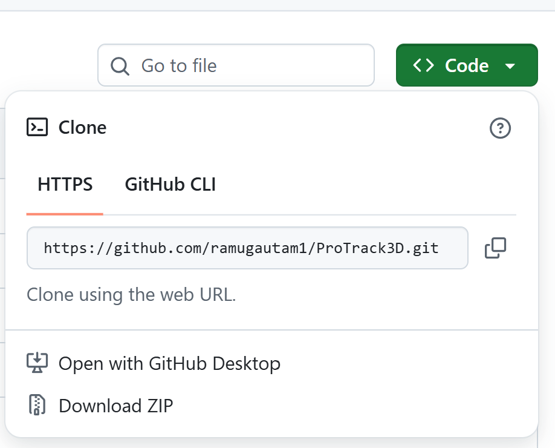
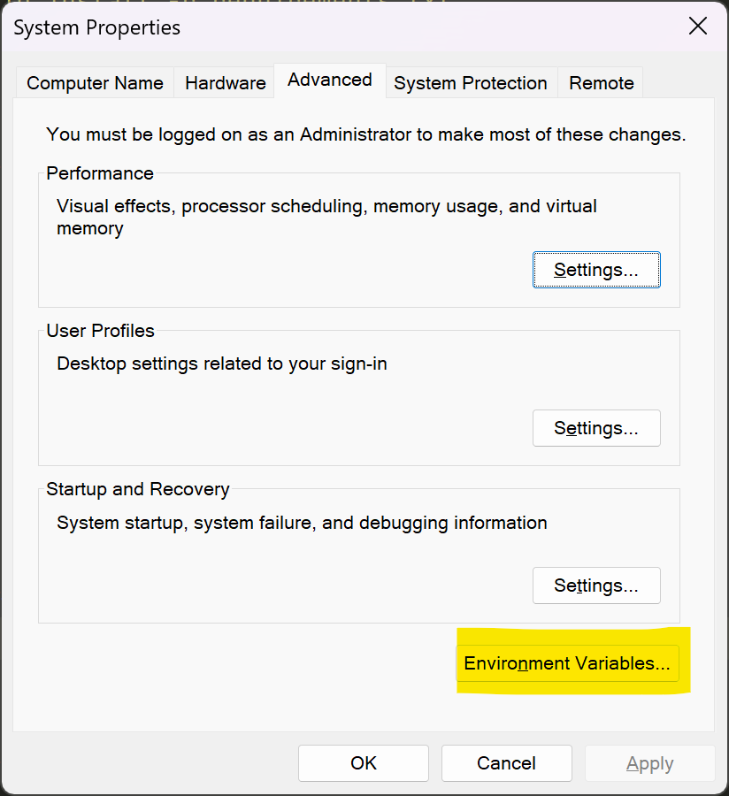
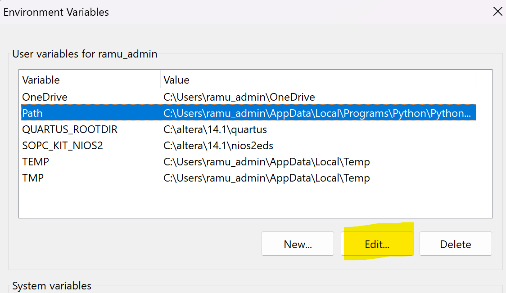
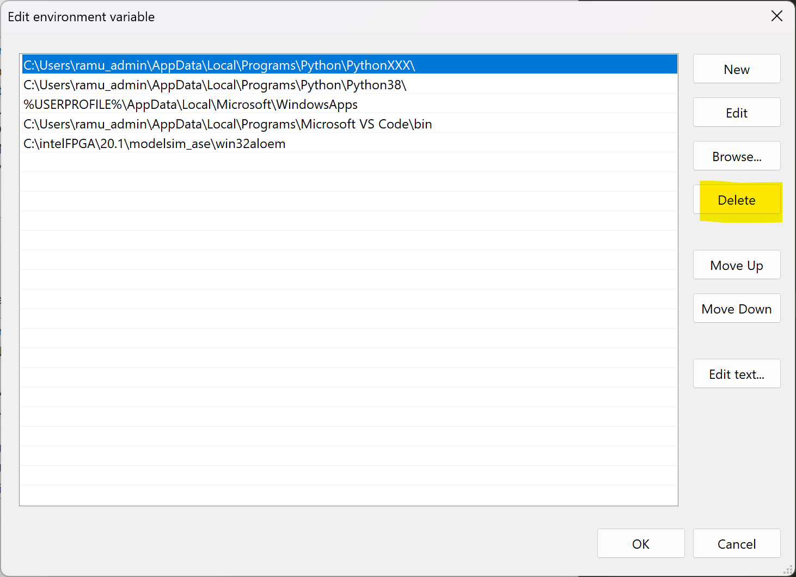

# PROTRACK3D


System requirements: 8 GB RAM

HDD/SSD space: 200 GB

CUDA compatible NVIDIA GPU

----------------------------------------------------


## Install Python
[Download Python] (https://www.python.org/ftp/python/3.8.0/python-3.8.0-amd64.exe)
* Run the executable to install python
* [x] Add Python to PATH variable

------


## Download ProTrack3D from GitHub
## Windows

Without Git
* https://github.com/ramugautam1/ProTrack3D
* Download ZIP

* Extract

----------- OR --------------

With Git

```bash
# open command prompt (search: cmd)
git clone https://github.com/ramugautam1/ProTrack3D.git
```
You may need to install Git

* [Download Git] (https://github.com/git-for-windows/git/releases/download/v2.50.0.windows.2/Git-2.50.0.2-64-bit.exe)
* Install Git


------------------------------------------------------------
# Running ProTrack3D

## Windows
  * First Run 
    * Navigate to ProTrack3D/dist  
    * run firstTimeRun.exe
    * - Download trained model from https://drive.google.com/drive/folders/17nJoRk8ZZRen42KcmwTJlUqaQSBffkeQ?usp=sharing
    * -  Extract and move the folder to ProTrack3D > checkpoints > FC-DenseNet

  * Otherwise
    * Navigate to ProTrack3D/dist  
    * run proTrack3D.exe
    * (Tip: Create Shortcut)
    
------------------------------------
### Linux
### First Run
```bash
  git clone https://github.com/ramugautam1/ProTrack3D.git
  cd ProTrack3D
  pip install virtualenv
  virtualenv -p python3.8 venv
  source venv/bin/activate
  pip install -r requirements.txt
  python main.py
```

### Otherwise
```
  cd ProTrack3D # get inside the project folder
  source venv/bin/activate
  python main.py
```

-----
# POSSIBLE ISSUES

#### If you have other versions of python installed
- Remove it from Path in Environment Variables





---------------------------------------------
### Bazooka Model
https://drive.google.com/drive/folders/1koS-f6sOxCH2zFlLpy2vRh7zoakYUXIq?usp=sharing


### Bazooka Image
https://drive.google.com/drive/folders/1ZPFuF1n3Kr6jI60Pj3Kk5zeGV2lV5qnK?usp=sharing

----------------------------------------------------
# Using ProTrack3D
- Download trained model from https://drive.google.com/drive/folders/17nJoRk8ZZRen42KcmwTJlUqaQSBffkeQ?usp=sharing
-  Extract and move the folder to ProTrack3D > checkpoints > FC-DenseNet

----
# Segmentation
## Training a new model from scratch


- Homepage >> Segmentation >> Train
- Model: FC-DenseNet
- No. of Epochs: 100 (usually sufficient.)
- Training Data Folder: Select the folder containing training data.
- RUN
-------------------------------------------------
## Finetuning a model
- homepage >> Segmentation >> Train
- Model: FC-DenseNet
- No. of Epochs: 100 (usually sufficient.)
- Training Data Folder: Select the folder containing training data.
- [x] Transfer Learning 
- Pre-trained Model: checkpoints >> FC-DenseNet >> BAZ...
- RUN

-------------------------------------------------
## Inference
- Homepage >> Segmentation >> Inference
- Model: FC-DenseNet
- Start Time (Enter)  (1-indexed, i.e., First timepoint is 1.)
- End Time (Enter)
- Input Image: Select the input .tif image.
- Output Folder: Select a folder
- Trained Model: Select a folder inside checkpoints >> FC-DenseNet
- RUN
-------------------------------------------------
-------------------------------------------------
# Tracking
- Homepage >> Tracking
- Select Folder with Segmentation Results :   select Seg. output folder >> FC-DenseNet
- Select Folder for Tracking Results
- Start Time [enter]
- Total Frames to Track [enter]
- Trackback Time [enter]
- RUN
-------------------------------------------------
-------------------------------------------------

# Family Tree
- Homepage >> Family Tree
- Select Tracking Results : Select any file inside Tracking Output Folder
- Select a folder to save
- Enter Object ID (format is shown in UI.)
- RUN

-------------------------------------------------
-------------------------------------------------
# Analysis
- Homepage >> Analysis
- Select Original Image
- Select Folder with Segmentation Results :   select Seg. output folder >> FC-DenseNet
- Select Folder with Tracking Results : select Tracking output folder
- Start Time (relative to the timepoints used in tracking)
- End Time (relative to the timepoints used in tracking)
- RUN
- (Plots and csv files will be saved in Tracking output folder >> Analysis  (eg Analysis1-100))
-----------------------------------------

